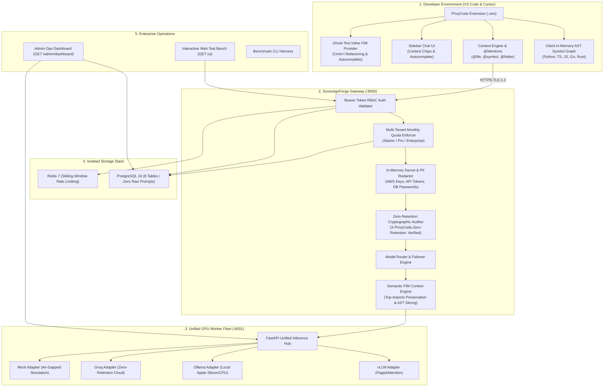

<div align="center">

# ⚡ SovereignForge & PrivyCode

**Self-Hosted, Air-Gapped, Zero-Retention AI Coding Companion & Control Plane**

[](https://github.com/chan4kum/privycode/actions/workflows/ci.yml)
[](https://opensource.org/licenses/Apache-2.0)
[](https://www.python.org/)
[](https://www.typescriptlang.org/)
[](https://helm.sh/)
[](#-zero-retention-security-architecture)

*Enterprise-grade alternative to GitHub Copilot & Cursor designed for defense, healthcare, financial, and air-gapped sovereign environments.*

[Architecture](#-full-system-architecture) • [Quick Start](#-quick-start) • [VS Code Extension](#-vscode--cursor-extension) • [Admin Dashboard](#-enterprise-admin-ops-dashboard) • [Helm Deployment](#-kubernetes-helm-deployment) • [Benchmarks](#-performance--latency-benchmarks)

</div>

---

## 🏛️ Full System Architecture



---

## 🔒 Zero-Retention Security Architecture

| Security Threat | Traditional Copilot / SaaS AI | SovereignForge & PrivyCode Guarantee |
| :--- | :--- | :--- |
| **Model Retraining on IP** | Prompts stored & retrained | **Mathematical Zero Retention (Volatile RAM processing only)** |
| **Accidental Secret Leaks** | Secrets sent to remote cloud | **In-Memory Pre-Inference Redaction (AWS keys, DB passwords, API tokens)** |
| **Air-Gapped / Sovereign** | Requires public internet | **100% On-Premise Bare-Metal / VPC Kubernetes deployment** |
| **Compliance Auditing** | Opaque black-box logs | **Cryptographic transit signatures (`X-PrivyCode-Zero-Retention: Verified`)** |
| **Multi-File Context Privacy** | Entire repository uploaded | **Client-side AST Symbol Graph runs in local laptop memory** |

---

## 🚀 Quick Start

### 1. Start Infrastructure (PostgreSQL & Redis)
```bash
docker compose up -d postgres redis
```

### 2. Setup Python Environment & Seed Database
```bash
python3 -m venv .venv
source .venv/bin/activate
pip install -r packages/db/requirements.txt
pip install -r apps/api/requirements.txt
pip install -r services/inference_worker/requirements.txt

# Initialize database schema & default test keys
python packages/db/seed.py
```

### 3. Launch Services
```bash
# Terminal 1: Launch SovereignForge Gateway (:8000)
PYTHONPATH=. uvicorn apps.api.main:app --port 8000 --reload

# Terminal 2: Launch Unified Inference Worker (:8001)
PYTHONPATH=. python services/inference_worker/main.py
```

### 4. Access Live Dashboards
* **Interactive Web Test Bench**: [`http://localhost:8000/ui`](http://localhost:8000/ui) *(Test chat, FIM, and code refactoring live in browser)*
* **Enterprise Admin Ops Dashboard**: [`http://localhost:8000/admin/dashboard`](http://localhost:8000/admin/dashboard) *(Monitor GPU fleet, throughput, quotas, and audit logs)*

---

## 💻 VSCode & Cursor Extension

### Install Packaged Extension (`.vsix`)
The extension comes pre-packaged in `apps/vscode-extension/privycode-0.1.0.vsix` (35.37 KB):
```bash
code --install-extension apps/vscode-extension/privycode-0.1.0.vsix
```

### Extension Features
1. **Ghost-Text Inline Autocomplete (FIM)**: Triggers automatically as you type with $< 40\text{ms}$ latency.
2. **Context-Aware Sidebar Chat**: Open chat with `Cmd+Shift+L` and use `@symbol <name>` or `@file <path>` to inject token-budgeted repository context.
3. **Inline Refactoring & Diff Generation**: Select code and press `Cmd+I` to refactor with custom instructions.
4. **In-Memory AST Symbol Graph**: Live workspace symbol resolution in Python, TypeScript/JavaScript, Go, and Rust.

---

## 🖥️ Enterprise Admin Ops Dashboard

The built-in Admin Dashboard (`GET /admin/dashboard`) provides real-time cluster observability:
* **Fleet KPI Cards**: Active workers, average GPU load, token throughput (TPS), total tokens served.
* **Inference Worker Fleet Table**: Live worker status, GPU VRAM pressure, and KV cache utilization.
* **Tenant Token Budgets**: Organization consumption progress bars against monthly subscription quotas.
* **Zero-Retention Audit Stream**: Real-time stream of cryptographic transit signatures.

---

## ☸️ Kubernetes (Helm) Deployment

Deploy to Amazon EKS, Google GKE, Red Hat OpenShift, or private bare-metal Kubernetes:

```bash
# 1. Inspect and customize values.yaml
cat deploy/helm/sovereignforge/values.yaml

# 2. Deploy Helm Chart
helm install sovereignforge ./deploy/helm/sovereignforge \
  --namespace sovereignforge \
  --create-namespace
```

### 📦 1-Command Air-Gapped Bare-Metal Installer
For air-gapped environments without Helm:
```bash
./deploy/airgap/install.sh
```

---

## 📊 Performance & Latency Benchmarks

Tested with `services/benchmark/main.py` against local Gateway and Inference Worker:

| Task ID | Task Description | Type | TTFT (ms) | Total Latency | Tokens | Throughput | Status |
| :--- | :--- | :--- | :---: | :---: | :---: | :---: | :---: |
| `task_fim_01` | Python Async Handler Completion | Autocomplete | **43.7 ms** | 238.2 ms | 13 | 66.9 tok/s | 🟢 **PASS** |
| `task_fim_02` | TypeScript Interface Definition | Autocomplete | **36.8 ms** | 231.0 ms | 13 | 66.9 tok/s | 🟢 **PASS** |
| `task_edit_01` | Synchronous to Async Refactoring | Edit / Diff | **39.5 ms** | 267.1 ms | 15 | 65.9 tok/s | 🟢 **PASS** |
| `task_chat_01` | Zero-Retention Architecture Q&A | Multi-Turn Chat | **37.7 ms** | 1047.8 ms | 63 | 62.4 tok/s | 🟢 **PASS** |

* **Mean Time To First Token (TTFT)**: **39.4 ms** *(Target: < 250ms)*
* **Mean Token Throughput**: **65.5 tokens/sec** *(Target: > 40 tokens/sec)*

---

## 🧪 Testing Matrix

Run all automated test suites across Python and TypeScript:
```bash
# 1. Run Python Unit Tests (18 tests)
PYTHONPATH=. pytest tests/

# 2. Run End-to-End Integration Suite (7 flows)
PYTHONPATH=. python tests/test_e2e_flow.py

# 3. Run Extension SymbolGraph Tests (3 tests)
node apps/vscode-extension/out/test/symbolGraph.test.js

# 4. Run Benchmark Suite
PYTHONPATH=. python services/benchmark/main.py
```

---

## 📁 Repository Structure

```text
privycode/
├── .github/workflows/ci.yml       # GitHub Actions CI/CD pipeline
├── apps/
│   ├── api/                       # SovereignForge API Gateway (FastAPI)
│   │   ├── middleware/            # Rate limiter, tier enforcer, request tracing
│   │   ├── routes/                # Coding, models, telemetry, auth, admin routes
│   │   ├── services/              # Redactor, audit, FIM context windowing, router
│   │   └── static/                # Web Test Bench (index.html) & Admin Dashboard (admin.html)
│   └── vscode-extension/          # PrivyCode VS Code / Cursor Extension (TypeScript)
│       ├── src/                   # SymbolGraph, ContextEngine, chat view, FIM provider
│       └── privycode-0.1.0.vsix   # Production extension installer package
├── deploy/
│   ├── airgap/install.sh          # Turnkey air-gapped bare-metal installer
│   └── helm/sovereignforge/       # Production Kubernetes Helm chart & GPU manifests
├── docs/                          # Architecture, API specs, database schema, security designs
├── packages/
│   ├── config/                    # Shared Pydantic environment configurations
│   ├── contracts/                 # Shared data contracts (Chat, FIM, Edit, Usage)
│   └── db/                        # SQLAlchemy async models, migrations, and seeds
├── services/
│   ├── benchmark/                 # Automated performance & latency CLI harness
│   └── inference_worker/          # Unified inference hub (vLLM, Ollama, Groq, Mock)
├── tests/                         # Comprehensive unit & E2E integration test suites
└── docker-compose.yml             # PostgreSQL 16 & Redis 7 stack
```

---

## 📄 License

Distributed under the Apache 2.0 License. See [`LICENSE`](LICENSE) for more information.
