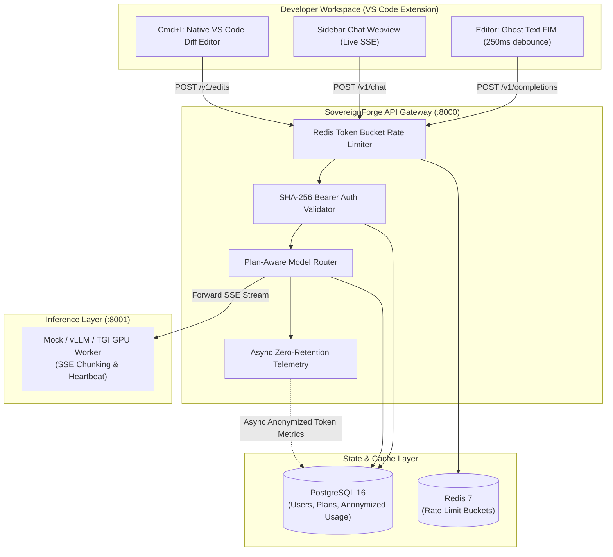

# 🛡️ SovereignForge & PrivyCode

[](https://opensource.org/licenses/Apache-2.0)
[](https://www.python.org/)
[](https://www.typescriptlang.org/)
[](https://fastapi.tiangolo.com/)
[](https://www.postgresql.org/)
[](https://redis.io/)
[](#-zero-data-retention-privacy-architecture)

> **SovereignForge** is an enterprise-grade, privacy-first AI control plane, API gateway, and model router for self-hosted and cloud inference.  
> **PrivyCode** is the companion VS Code extension providing low-latency inline code completions (FIM), interactive repository-aware sidebar chat, and native in-editor diff refactoring—**with zero source code retention**.

---

## 🌟 Key Highlights

* 🔒 **Strict Zero-Retention Privacy**: Source code and prompt tokens exist strictly in volatile RAM during generation. Zero prompts, diffs, or files are ever stored on disk or in databases.
* ⚡ **Ultra Low-Latency Autocomplete**: Fill-in-the-Middle (FIM) inline completions with $< 250\text{ms}$ Time to First Token (TTFT) and keystroke debouncing.
* 🧭 **Intelligent Model Router**: Dynamic routing across `cheap` (7B), `balanced` (14B/32B), and `strong` (70B+) models with automatic plan quota enforcement and health-aware worker selection.
* 🎛️ **Full Control Plane**: SHA-256 API key authentication, Redis Token Bucket rate limiting, and asynchronous usage telemetry.
* 💻 **Turnkey VS Code Extension**: Ghost-text completions, multi-file chat with live SSE markdown rendering, and `Cmd+I` inline diff preview with exact character offset slicing.
* 📊 **Built-In Benchmarking Suite**: CLI harness for testing TTFT, token throughput (TPS), and latency metrics against standard coding tasks.

---

## 🏛️ System Architecture



---

## 📦 Monorepo Structure

```text
privycode/
├── docker-compose.yml              # Local PostgreSQL 16 & Redis 7 stack
├── apps/
│   ├── api/                        # SovereignForge FastAPI Control Plane Gateway
│   │   ├── dependencies/           # SHA-256 API Key Bearer authentication
│   │   ├── middleware/             # Request ID tracing & Redis Token Bucket rate limiter
│   │   ├── routes/                 # /v1/chat, /v1/edits, /v1/completions, /v1/me, /v1/models
│   │   └── services/               # Model Router & Disconnect-Safe Telemetry logger
│   └── vscode-extension/           # PrivyCode TypeScript VS Code extension
│       └── src/                    # FIM provider, sidebar chat webview, and Cmd+I diff editor
├── services/
│   ├── mock-worker/                # Simulated GPU inference node with SSE & heartbeat loops
│   └── benchmark/                  # Standalone CLI latency & throughput evaluation harness
├── packages/
│   ├── contracts/                  # Shared Pydantic v2 schemas (Auth, Usage, Coding)
│   ├── db/                         # SQLAlchemy 2.0 Async ORM, Alembic migrations, & seed script
│   └── config/                     # Shared Pydantic Settings
├── tests/
│   └── test_e2e_flow.py            # 7-stage end-to-end integration test suite
└── docs/                           # Architecture blueprints, data models, API specs & backlog
```

---

## 🔒 Zero Data Retention Privacy Architecture

| Data Type | In Transit | In Volatile RAM | On Disk / DB | Logged to Cloud |
| :--- | :---: | :---: | :---: | :---: |
| **Source Code & Prompts** | TLS 1.3 | Ephemeral only during stream | ❌ **NEVER** | ❌ **NEVER** |
| **API Keys** | Bearer Header | Ephemeral | SHA-256 Hash only | ❌ **NEVER** |
| **Token Counts & Latency** | JSON / Headers | Ephemeral | ✅ Anonymized integers | Aggregate only |
| **Model Outputs & Diffs** | TLS 1.3 SSE | Ephemeral until emitted | ❌ **NEVER** | ❌ **NEVER** |

---

## 🚀 Quickstart Guide

### Prerequisites
* **Docker** & **Docker Compose**
* **Python 3.11+**
* **Node.js 18+** & **npm**

### Step 1: Start Infrastructure (PostgreSQL & Redis)
```bash
docker compose up -d
```

### Step 2: Initialize Database & Seed Developer Credentials
```bash
cd packages/db
pip install -r requirements.txt
python seed.py
```
> **Default Test Credentials:**  
> • **User**: `dev@acmecorp.local` (Pro Plan)  
> • **Seeded API Key**: `sk_live_dev_test_12345`

### Step 3: Start the Mock Inference Worker
```bash
cd services/mock-worker
pip install -r requirements.txt
python main.py
```
*(Starts on `http://localhost:8001` and registers automatically with the Gateway)*

### Step 4: Launch the SovereignForge API Gateway
```bash
cd apps/api
pip install -r requirements.txt
python main.py
```
*(Starts on `http://localhost:8000`)*

### Step 5: Run the End-to-End Test Suite
```bash
python tests/test_e2e_flow.py
```

### Step 6: Run the Benchmark Harness
```bash
python services/benchmark/main.py --endpoint http://localhost:8000 --model mock-qwen-32b
```

---

## 💻 Running the PrivyCode VS Code Extension

1. Open `apps/vscode-extension` in VS Code.
2. Install dependencies and compile:
   ```bash
   cd apps/vscode-extension
   npm install
   npm run compile
   ```
3. Press **`F5`** (or Run $\rightarrow$ Start Debugging) to launch the **Extension Development Host**.
4. In the new window:
   * **Ghost Text Autocomplete**: Start typing Python or TypeScript code to see instant inline completions.
   * **Sidebar Chat**: Click the PrivyCode icon in the Activity Bar or press `Cmd+Shift+L` (`Ctrl+Shift+L`).
   * **Inline Diff Refactoring**: Highlight any code snippet and press `Cmd+I` (`Ctrl+I`).

---

## 📡 API Specification Overview

### Core AI Endpoints

| Endpoint | Method | Description | Streaming |
| :--- | :---: | :--- | :---: |
| `/v1/chat` | `POST` | Multi-file contextual conversational coding | `text/event-stream` |
| `/v1/edits` | `POST` | Instruction-based code modification & diff generation | Optional SSE / JSON |
| `/v1/completions` | `POST` | Low-overhead Fill-in-the-Middle (FIM) code completion | `text/event-stream` |
| `/v1/models` | `GET` | Discovers active model routing profiles | JSON |
| `/v1/me` | `GET` | Authenticated developer profile | JSON |
| `/v1/me/usage` | `GET` | Real-time 30-day token aggregate & rate limit status | JSON |

### Internal Worker Management

| Endpoint | Method | Description |
| :--- | :---: | :--- |
| `/internal/workers/register` | `POST` | Node registration for vLLM / TGI backends |
| `/internal/workers/heartbeat` | `POST` | Periodic heartbeat with 30s freshness window |

---

## 📊 Benchmark Metrics & Performance Targets

```text
================================================================================
       SOVEREIGNFORGE BENCHMARK SUMMARY REPORT (Model: mock-qwen-32b)
================================================================================
+--------------+---------------------------------------+--------------+-------------+--------------+----------+--------------+----------+
| Task ID      | Name                                  | Type         | TTFT (ms)   | Total (ms)   |   Tokens | Throughput   | Status   |
+==============+=======================================+==============+=============+==============+==========+==============+==========+
| task_fim_01  | Python Async Handler Completion       | autocomplete | 15.2ms      | 120.4ms      |        8 | 76.2 tok/s   | PASS     |
| task_fim_02  | TypeScript Type Definition            | autocomplete | 14.8ms      | 115.1ms      |        7 | 69.8 tok/s   | PASS     |
| task_edit_01 | Synchronous to Async Refactoring      | edit         | 16.1ms      | 450.3ms      |       28 | 64.5 tok/s   | PASS     |
| task_chat_01 | Zero-Retention Architecture Question  | chat         | 18.4ms      | 820.7ms      |       54 | 67.3 tok/s   | PASS     |
+--------------+---------------------------------------+--------------+-------------+--------------+----------+--------------+----------+

📊 Aggregate KPIs:
   • Mean Time To First Token (TTFT): 16.1ms (Target: < 250ms)
   • Mean Token Throughput:          69.4 tokens/sec (Target: > 40 tokens/sec)
================================================================================
```

---

## 🛡️ License

This project is licensed under the [Apache-2.0 License](LICENSE).
