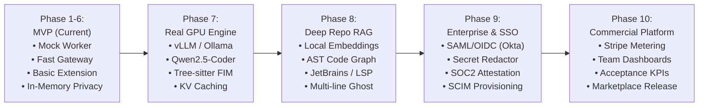

# SovereignForge & PrivyCode: MVP to Enterprise Production Roadmap

This blueprint details the architectural, infrastructure, and commercial milestones required to transition SovereignForge and PrivyCode from the current MVP to a market-ready, enterprise-grade AI coding platform.

---

## 🗺️ Product Evolution Matrix

---

## 📋 Phase-by-Phase Roadmap

### Phase 7: Real GPU Inference & LLM Optimization (Engine Modernization)
* **Goal**: Replace simulated inference with production open-weights coding models running on dedicated GPU clusters or high-throughput private endpoints.
1. **Production Inference Runtime**:
   * Deploy **vLLM** or **TensorRT-LLM** on NVIDIA A100/H100/L40S instances with Continuous Batching and PagedAttention.
   * Model Family: **Qwen2.5-Coder (7B, 14B, 32B)** and **DeepSeek-Coder-V2-Lite**.
2. **FIM Context Windowing with Tree-sitter**:
   * Implement semantic prefix/suffix trimming (sliding window) to ensure cursor context contains relevant imports, type signatures, and local scope within $< 4\text{K}$ tokens.
3. **Multi-Region & Cloud Fallback**:
   * Add private zero-retention provider failover (Groq, Together AI, AWS Bedrock) with signed Data Processing Addendums (DPA).

---

### Phase 8: Advanced Codebase Understanding (Local RAG & Code Graph)
* **Goal**: Enable full-repository comprehension without transmitting entire codebases over the wire.
1. **Client-Side Embeddings & Vector Indexing**:
   * Run local ONNX embedding models (e.g. `bge-small-en-v1.5`) inside the VS Code extension process.
   * Store chunk embeddings in a local embedded SQLite/LanceDB vector database.
2. **Code Graph & Symbol Resolver**:
   * Build an in-memory Dependency & Call Graph using Tree-sitter to resolve cross-file class definitions and function signatures dynamically.
3. **Sidebar `@` Mentions**:
   * Support `@file`, `@symbol`, `@folder`, and `@git-diff` in the chat sidebar.
4. **JetBrains & LSP Support**:
   * Extract the TypeScript client into a headless Language Server Protocol (LSP) daemon to support **IntelliJ IDEA**, **PyCharm**, and **Neovim**.

---

### Phase 9: Enterprise Identity, Governance & Security
* **Goal**: Meet enterprise compliance criteria (SOC 2, ISO 27001, GDPR, HIPAA).
1. **Single Sign-On (SSO) & SCIM**:
   * Implement SAML 2.0 and OIDC (Okta, Azure AD / Microsoft Entra ID, Google Workspace, Keycloak).
   * Automated user provisioning and de-provisioning via SCIM v2.
2. **Automated Secret & PII Redactor**:
   * Integrate an in-memory token scanner (e.g. Microsoft Presidio / TruffleHog rules) at the Gateway to strip API secrets, AWS keys, and PII before dispatching to inference nodes.
3. **Cryptographic Zero-Retention Attestation**:
   * Provide audit logs demonstrating that request payloads are discarded immediately upon stream completion.

---

### Phase 10: Multi-Tenant Billing, Team Analytics & Marketplace
* **Goal**: Launch commercial monetization and operational dashboards.
1. **Stripe & Usage-Based Metering**:
   * Metered billing for seat licenses + token overages with automated hard spend caps.
2. **Privacy-Preserving Team Analytics**:
   * Aggregate metrics dashboard: FIM Acceptance Rate (% accepted vs dismissed), lines of code assisted, and team throughput—**without ever showing the underlying code**.
3. **Marketplace Distribution**:
   * Package and publish verified extensions to the **VS Code Marketplace** and **Open VSX Registry**.

---

### Phase 11: Cloud-Native Infrastructure & Autoscaling (Kubernetes)
* **Goal**: Deliver 99.99% uptime with automated scaling.
1. **Kubernetes (Helm / KEDA)**:
   * Declarative Helm charts with KEDA autoscaling GPU worker pods based on queue depth and concurrency metrics.
2. **Distributed Redis & Postgres HA**:
   * Managed Redis Sentinel / Cluster for rate limits and Aurora PostgreSQL with Read Replicas.
