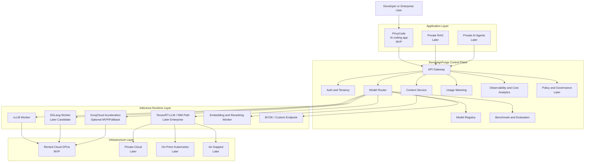
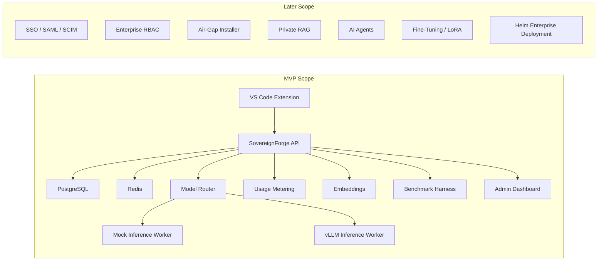
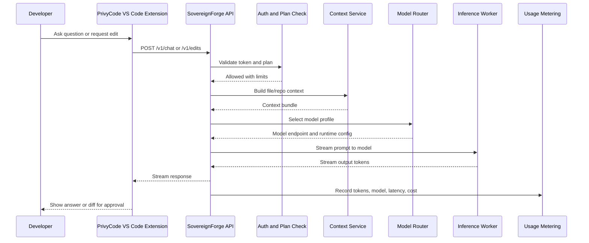
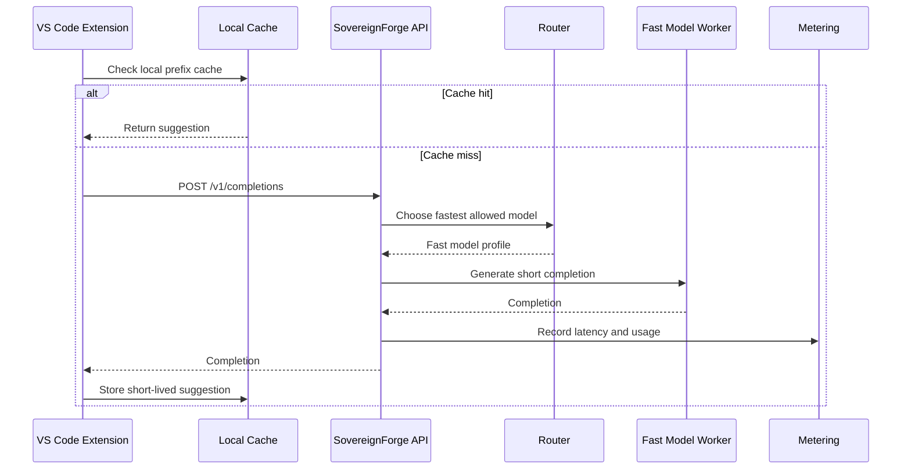
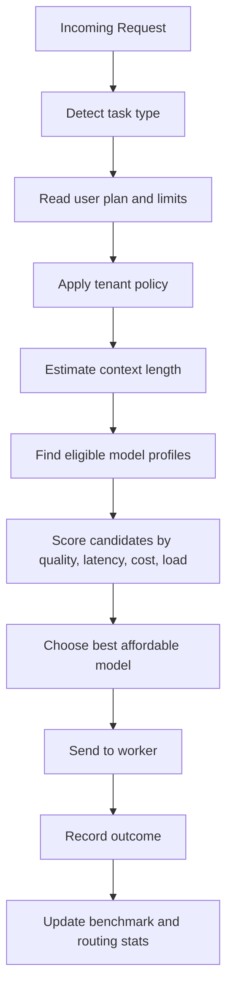
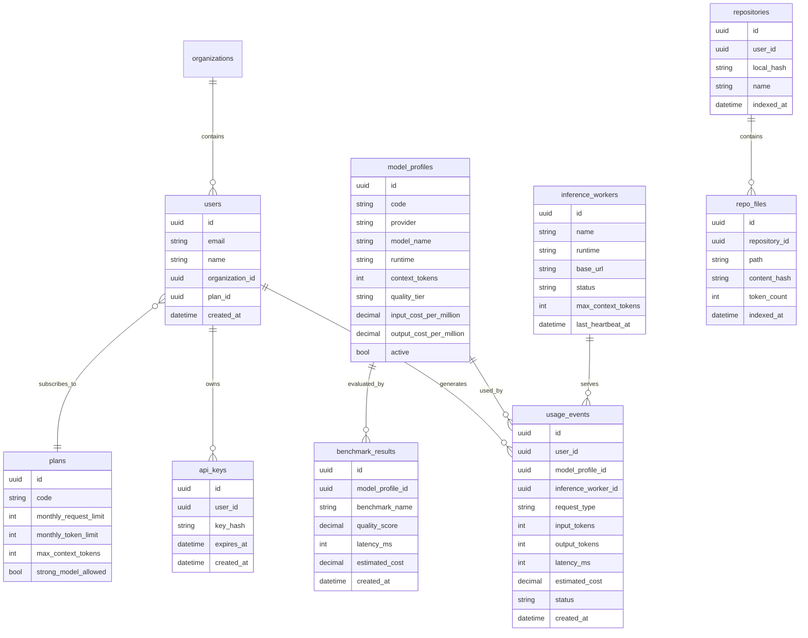
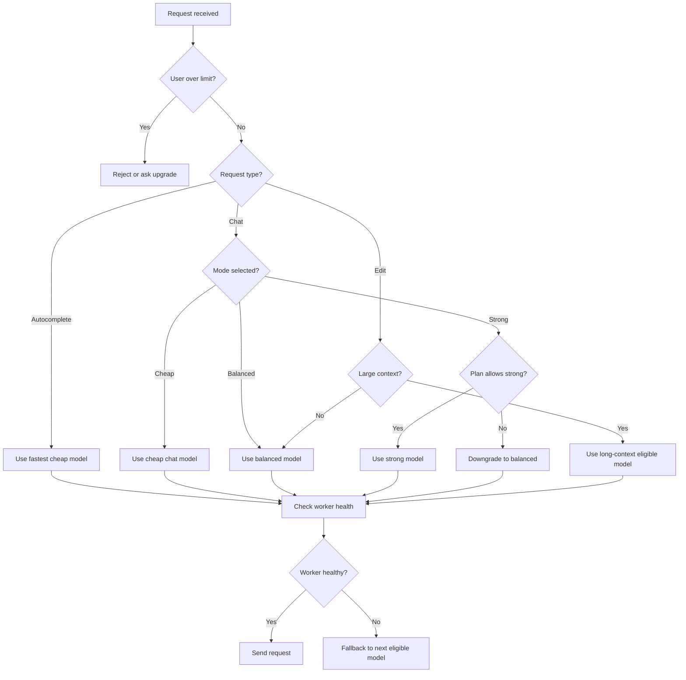
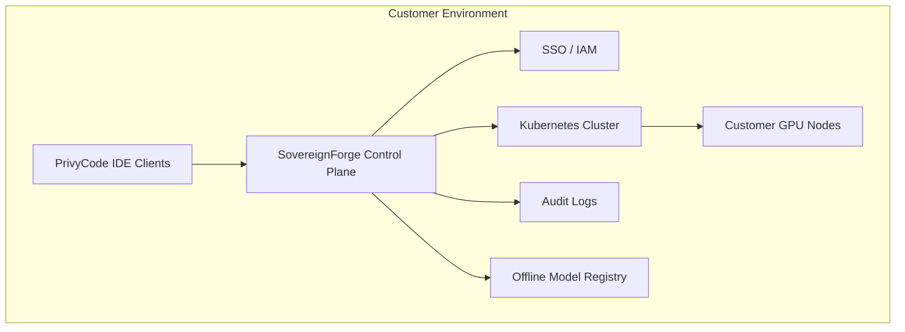

# PrivyCode + SovereignForge Technical Architecture and Step-by-Step Implementation Plan

Date: 14 August 2026  
Version: 1.0  
Purpose: Give an LLM/code agent a clear architecture, build order, boundaries, and small implementation steps.

## 1. How To Read This Document

This document is written for implementation by an LLM coding agent.

The agent should build in this order:

1. Local monorepo skeleton.
2. Shared contracts and database schema.
3. SovereignForge API gateway.
4. Mock inference worker.
5. Model registry and router.
6. Usage metering and plan limits.
7. PrivyCode VS Code extension.
8. Repository context service.
9. Real vLLM inference worker.
10. Benchmark harness.
11. Admin dashboard.
12. BYOK/custom endpoint.
13. Team and enterprise foundations.

Do not start with enterprise deployment, air-gapped packaging, fine-tuning, or multi-agent orchestration. Those are later phases.

## 2. Fixed Product Architecture

SovereignForge is the infrastructure/control plane.

PrivyCode is the first application.

Private RAG and AI Agents are future applications that reuse the same control plane.



## 3. MVP System Boundary

Build only the boxes marked MVP first.



## 4. Recommended Monorepo Structure

Use a monorepo so shared contracts stay consistent.

```text
privycode-sovereignforge/
  apps/
    api/                    # SovereignForge API gateway
    vscode-extension/        # PrivyCode VS Code extension
    admin-web/               # Admin dashboard
  services/
    mock-inference-worker/   # Local fake model server for development
    vllm-worker/             # Real model runtime wrapper
    embedding-worker/        # Repository embeddings and reranking
    benchmark-runner/        # Evaluation jobs
  packages/
    contracts/               # Shared API types and schemas
    db/                      # Database schema and migrations
    sdk/                     # Client SDK used by extension/admin
    config/                  # Shared config loader
    telemetry/               # Logging/metrics helpers
  infra/
    docker/                  # Local Docker Compose files
    terraform/               # Cloud infra later
    helm/                    # Enterprise later
  docs/
    architecture.md
    api.md
    runbooks.md
```

## 5. Core Data Flow

### Chat / Inline Edit Flow



### Autocomplete Flow



### Model Routing Flow



## 6. Main Services

### 6.1 PrivyCode VS Code Extension

Responsibility:

1. Collect selected code, current file, open tabs, and limited repository metadata.
2. Show chat UI.
3. Provide inline edit workflow.
4. Provide autocomplete provider.
5. Apply model-generated diffs only after user approval.
6. Send requests to SovereignForge API.

Do not put model routing or billing logic inside the extension.

### 6.2 SovereignForge API Gateway

Responsibility:

1. Authenticate requests.
2. Enforce plan limits.
3. Normalize API requests.
4. Call context builder.
5. Call model router.
6. Stream responses.
7. Record usage.
8. Expose admin metrics.

This is the central backend service for MVP.

### 6.3 Context Service

Responsibility:

1. Build prompt context from selected code, current file, file tree, symbols, and relevant snippets.
2. Keep context small and high quality.
3. Avoid sending unnecessary files.
4. Later support embeddings and reranking.

MVP can start with simple heuristics before vector search:

1. Selected text.
2. Current file.
3. Neighboring imports.
4. User-provided file references.
5. Recently opened files.

### 6.4 Model Router

Responsibility:

1. Choose model profile for each request.
2. Consider task type, plan, estimated tokens, latency target, GPU load, and policy.
3. Fall back when a worker is unavailable.
4. Emit routing decision logs.

The router is where the future moat starts. Keep it modular from day one.

### 6.5 Inference Worker

Responsibility:

1. Provide OpenAI-compatible chat/completion endpoints internally.
2. Run model using mock worker first, vLLM second.
3. Report health, model name, context length, tokens/sec, queue length, and GPU utilization where available.

### 6.6 Usage Metering

Responsibility:

1. Track every request.
2. Track user, plan, model profile, input tokens, output tokens, latency, estimated cost, and status.
3. Enforce monthly allowance.
4. Support admin cost analytics.

### 6.7 Benchmark Runner

Responsibility:

1. Run standard coding tasks against candidate models.
2. Compare quality, latency, and cost.
3. Store benchmark results.
4. Feed model routing decisions.

## 7. Suggested Technology Choices

For fastest MVP:

| Area | Choice | Reason |
|---|---|---|
| Monorepo | pnpm workspaces or Turborepo | Good TypeScript sharing |
| API | Node.js TypeScript with Fastify/NestJS, or Python FastAPI | Choose one; TypeScript pairs well with VS Code extension |
| Extension | TypeScript VS Code extension API | Native ecosystem |
| DB | PostgreSQL | Reliable relational metadata |
| Cache/queue | Redis | Rate limits, queues, short cache |
| ORM | Prisma or Drizzle if TypeScript | Fast schema iteration |
| Validation | Zod | Shared request/response contracts |
| Inference | vLLM | Strong OSS serving baseline |
| Acceleration provider | GroqCloud optional | Very fast hosted inference for early MVP, burst traffic, and fallback |
| Local dev | Docker Compose | Easy repeatable setup |
| Metrics | OpenTelemetry + Prometheus/Grafana later | Observability path |

Recommended MVP stack for an LLM agent: TypeScript monorepo, Fastify API, Prisma/PostgreSQL, Redis, VS Code extension, mock inference first, vLLM later.

## 7.1 GroqCloud Acceleration Strategy

Groq can be used to accelerate development and early user experience, but it should not replace SovereignForge.

Use Groq as an optional model provider behind the SovereignForge router.

### Where Groq Fits

Good fit:

1. Fast MVP validation before GPU infrastructure is mature.
2. Burst traffic when rented GPU workers are overloaded.
3. Low-latency coding chat and short autocomplete experiments.
4. Benchmark comparison against self-hosted vLLM models.
5. Fallback provider when self-hosted workers fail.
6. BYOK mode if user wants to use their own Groq API key.

Poor fit:

1. Air-gapped deployment.
2. Strict on-prem-only enterprise customers.
3. Customers that prohibit external model APIs.
4. Workloads requiring full infrastructure ownership.
5. The long-term core moat if used without benchmarking, routing, and cost controls.

### Architecture Rule

Groq must be integrated through a generic provider interface:

```text
ModelProvider
  - self_hosted_vllm
  - self_hosted_sglang
  - groq_cloud
  - custom_openai_compatible
  - enterprise_nim_later
```

Do not hardcode Groq into PrivyCode extension code.

Do not make the API depend on Groq-specific request shapes outside the provider adapter.

### Router Behavior With Groq

The router may choose Groq when:

1. Request mode is `balanced` or `strong`.
2. The selected model profile is marked `provider = groq_cloud`.
3. User plan allows external hosted inference.
4. Tenant policy does not require private-only processing.
5. Cost estimate is within user plan limits.
6. Rate limit budget is available.

The router must not choose Groq when:

1. User enables local-only/private-only mode.
2. Enterprise policy says external inference is disabled.
3. Request contains files marked sensitive by policy.
4. Groq rate limits are exhausted.
5. Groq spend limit is near the configured cap.

### Groq Provider Adapter

Add a provider adapter with this shape:

```ts
type InferenceProvider = {
  code: string;
  supportsStreaming: boolean;
  supportsChat: boolean;
  supportsCompletions: boolean;
  supportsEmbeddings: boolean;
  chat(request: InternalChatRequest): AsyncIterable<InternalChatChunk>;
  complete(request: InternalCompletionRequest): Promise<InternalCompletionResponse>;
  health(): Promise<ProviderHealth>;
};
```

Groq adapter responsibilities:

1. Convert internal chat/completion request into OpenAI-compatible Groq API call.
2. Support streaming.
3. Map Groq model IDs to internal `model_profiles`.
4. Capture token usage, latency, and errors.
5. Handle rate limit responses.
6. Retry only safe transient failures with jittered backoff.
7. Never log API keys or full prompts.

### Suggested Groq Model Profiles

Initial profiles can include:

1. `groq-llama-8b-fast`: cheap/fast experiments and lightweight chat.
2. `groq-llama-70b-balanced`: better coding chat and explanations.
3. `groq-gpt-oss-20b-fast`: fast open-weight coding/reasoning experiments.
4. `groq-gpt-oss-120b-strong`: stronger reasoning/coding experiments where cost allows.

The exact model list should be loaded from configuration because Groq model availability can change.

### Cost and Rate Limit Controls

Groq usage must be protected by:

1. Monthly budget cap.
2. Per-user token cap.
3. Per-plan routing policy.
4. Per-model max output token limit.
5. Backoff on HTTP 429 rate limits.
6. Backoff or fallback on flex capacity errors.
7. Admin dashboard visibility by provider.

### Privacy Requirement

Default MVP behavior should disclose when a request is routed to hosted external inference.

Enterprise/private mode must allow this policy:

```text
external_inference_allowed = false
```

When that policy is false, Groq, OpenAI, Anthropic, or any other external provider must be excluded from routing.

## 8. Core Database Tables

Start with these tables only.



## 9. API Surface For MVP

Use versioned APIs.

### Auth and User

```text
POST /v1/auth/login
POST /v1/auth/logout
GET  /v1/me
GET  /v1/me/usage
```

### Coding

```text
POST /v1/chat
POST /v1/edits
POST /v1/completions
POST /v1/repositories/index
GET  /v1/repositories/:id/status
```

### Models and Routing

```text
GET  /v1/models
POST /v1/router/preview
```

### Worker Internal APIs

```text
POST /internal/workers/register
POST /internal/workers/heartbeat
POST /internal/inference/chat
POST /internal/inference/completions
```

### Admin

```text
GET /admin/metrics
GET /admin/usage
GET /admin/models
GET /admin/workers
GET /admin/benchmarks
```

## 10. Shared Request Shapes

Keep contracts explicit so extension and API do not drift.

```ts
type RequestMode = "cheap" | "balanced" | "strong";
type RequestType = "chat" | "edit" | "autocomplete" | "agent_edit";

type CodeContext = {
  repositoryId?: string;
  filePath?: string;
  languageId?: string;
  selectedText?: string;
  currentFileContent?: string;
  openFiles?: Array<{ path: string; content: string }>;
  diagnostics?: Array<{ path: string; message: string; line?: number }>;
};

type ChatRequest = {
  requestType: "chat";
  mode: RequestMode;
  message: string;
  context: CodeContext;
};

type EditRequest = {
  requestType: "edit";
  mode: RequestMode;
  instruction: string;
  context: CodeContext;
};

type CompletionRequest = {
  requestType: "autocomplete";
  mode: "cheap" | "balanced";
  prefix: string;
  suffix?: string;
  context: CodeContext;
  maxTokens: number;
};
```

## 11. Router Decision Logic

Start simple. Do not build ML-based routing first.



Initial scoring formula:

```text
score = quality_weight * quality_score
      - latency_weight * normalized_latency
      - cost_weight * normalized_cost
      - load_weight * current_queue_penalty
```

MVP can hardcode weights:

1. Autocomplete: latency high, cost high, quality medium.
2. Chat: quality high, cost medium, latency medium.
3. Edit: quality high, context high, latency low.
4. Free/Developer plan: cost high.
5. Pro/Power plan: quality higher.

## 12. Step-by-Step Implementation Plan

Each step should be a small pull request or task. Do not combine unrelated steps.

### Phase 0: Project Foundation

#### Step 0.1: Create Monorepo

Goal: Empty project runs locally.

Tasks:

1. Create root workspace.
2. Add apps/api.
3. Add apps/vscode-extension.
4. Add apps/admin-web.
5. Add services/mock-inference-worker.
6. Add packages/contracts.
7. Add packages/db.
8. Add packages/config.
9. Add README with local setup.

Acceptance criteria:

1. Install command succeeds.
2. Build command succeeds.
3. Lint command succeeds.
4. Empty services can start.

#### Step 0.2: Add Shared Config

Goal: All services read configuration consistently.

Tasks:

1. Define environment variables.
2. Add config validation.
3. Add .env.example.
4. Fail startup if required config is missing.

Acceptance criteria:

1. API starts with .env.example values.
2. Missing required variable shows clear error.

#### Step 0.3: Add Docker Compose

Goal: Local infrastructure starts with one command.

Tasks:

1. Add PostgreSQL container.
2. Add Redis container.
3. Add API container optional.
4. Add mock inference worker container optional.

Acceptance criteria:

1. Database is reachable.
2. Redis is reachable.
3. API health endpoint returns OK.

### Phase 1: Contracts and Database

#### Step 1.1: Define Shared API Contracts

Goal: API and extension use the same types.

Tasks:

1. Create request/response schemas for chat, edits, completions, usage, models.
2. Add validation with Zod or equivalent.
3. Export TypeScript types from schemas.

Acceptance criteria:

1. Invalid request fails validation.
2. API imports shared contracts.
3. Extension can import shared contracts.

#### Step 1.2: Create Database Schema

Goal: Store users, plans, models, workers, usage, and benchmark results.

Tasks:

1. Add users table.
2. Add plans table.
3. Add api_keys table.
4. Add model_profiles table.
5. Add inference_workers table.
6. Add usage_events table.
7. Add benchmark_results table.
8. Add repositories and repo_files tables.
9. Add seed data for Free, Developer, Pro, Power plans.
10. Add seed model profiles: mock-cheap, mock-strong.

Acceptance criteria:

1. Migration runs from empty database.
2. Seed command creates plans and model profiles.
3. Test query can load model profiles.

### Phase 2: API Gateway MVP

#### Step 2.1: API Health and Service Skeleton

Goal: API is runnable and observable.

Tasks:

1. Add /health endpoint.
2. Add structured logging.
3. Add request ID middleware.
4. Add error handler.

Acceptance criteria:

1. /health returns service name, version, and status.
2. Errors return consistent JSON.

#### Step 2.2: Simple Auth For MVP

Goal: API can identify a user.

Tasks:

1. Implement API key auth first.
2. Store hashed API keys.
3. Add GET /v1/me.
4. Create local dev seed user and key.

Acceptance criteria:

1. Request without key is rejected.
2. Request with dev key succeeds.
3. User plan is returned.

#### Step 2.3: Usage Metering Service

Goal: Every AI request can be recorded.

Tasks:

1. Create usage recording function.
2. Estimate token counts with simple tokenizer approximation first.
3. Calculate estimated cost from model profile.
4. Add GET /v1/me/usage.

Acceptance criteria:

1. Usage event is stored after a mock request.
2. Monthly token usage is returned.
3. Estimated cost is visible to admin endpoint.

#### Step 2.4: Plan Limit Enforcement

Goal: Low-cost plans cannot run unlimited inference.

Tasks:

1. Check monthly token limit.
2. Check monthly request limit.
3. Check max context tokens.
4. Reject or downgrade requests when needed.

Acceptance criteria:

1. User over token limit gets clear error.
2. Strong mode is blocked for plans that do not allow it.
3. Large context is rejected with clear message.

### Phase 3: Mock Inference and Router

#### Step 3.1: Mock Inference Worker

Goal: Develop app without GPU.

Tasks:

1. Create mock worker service.
2. Add /health.
3. Add /v1/chat/completions compatible endpoint.
4. Return deterministic fake streaming and non-streaming responses.
5. Add artificial latency config.

Acceptance criteria:

1. API can call mock worker.
2. Streaming response works.
3. Worker health is visible.

#### Step 3.2: Worker Registry

Goal: API knows available workers.

Tasks:

1. Add worker registration endpoint.
2. Add heartbeat endpoint.
3. Store status and last heartbeat.
4. Ignore stale workers in routing.

Acceptance criteria:

1. Mock worker registers on startup.
2. API marks worker unhealthy after heartbeat timeout.

#### Step 3.3: Model Router v1

Goal: Route requests by task, mode, plan, and worker health.

Tasks:

1. Implement model selection function.
2. Filter inactive models.
3. Filter models not allowed by plan.
4. Filter models too small for context.
5. Choose by static priority.
6. Add route preview endpoint.

Acceptance criteria:

1. Autocomplete chooses cheap model.
2. Strong mode chooses strong model when allowed.
3. Router falls back if preferred worker is unhealthy.
4. Every response records selected model profile.

### Phase 4: Coding APIs

#### Step 4.1: Chat Endpoint

Goal: Extension can send coding questions.

Tasks:

1. Implement POST /v1/chat.
2. Validate request.
3. Build prompt from message and context.
4. Call router.
5. Stream model response.
6. Record usage.

Acceptance criteria:

1. Chat works with mock worker.
2. Invalid context fails validation.
3. Usage is recorded.

#### Step 4.2: Edit Endpoint

Goal: API returns a patch-style edit.

Tasks:

1. Implement POST /v1/edits.
2. Prompt model to return unified diff or structured edit.
3. Validate response shape where possible.
4. Return edit preview to client.
5. Record usage.

Acceptance criteria:

1. API returns an edit proposal.
2. API never directly modifies files.
3. Extension must approve/apply edits.

#### Step 4.3: Completion Endpoint

Goal: API supports autocomplete.

Tasks:

1. Implement POST /v1/completions.
2. Keep max tokens small.
3. Route to cheap/fast model.
4. Add short timeout.
5. Record latency.

Acceptance criteria:

1. Completion returns within configured timeout using mock worker.
2. Long requests are rejected.
3. Usage is recorded as autocomplete.

### Phase 5: PrivyCode VS Code Extension

#### Step 5.1: Extension Skeleton

Goal: Extension installs and connects to API.

Tasks:

1. Create VS Code extension.
2. Add settings for API URL and API key.
3. Add command: PrivyCode: Sign In / Set API Key.
4. Add command: PrivyCode: Check Connection.

Acceptance criteria:

1. Extension loads in VS Code development host.
2. Check Connection calls /v1/me.
3. Clear error shown for invalid API key.

#### Step 5.2: Coding Chat Panel

Goal: User can ask questions from VS Code.

Tasks:

1. Add webview chat panel.
2. Send selected text and current file context.
3. Stream response into chat.
4. Show model/mode used when available.

Acceptance criteria:

1. User asks question about selected code.
2. Response streams back.
3. Failed request shows useful message.

#### Step 5.3: Inline Edit Workflow

Goal: User can request edits and approve diffs.

Tasks:

1. Add command: PrivyCode: Edit Selection.
2. Send selected code and instruction.
3. Receive proposed diff or replacement.
4. Show preview.
5. Apply only after user confirmation.

Acceptance criteria:

1. Edit is never applied silently.
2. User can reject edit.
3. User can apply edit to current file.

#### Step 5.4: Autocomplete Provider

Goal: Basic code suggestions work.

Tasks:

1. Register inline completion provider.
2. Send prefix/suffix to completion endpoint.
3. Add debounce.
4. Add local short-lived prefix cache.
5. Disable on large files or unsupported languages initially.

Acceptance criteria:

1. Suggestions appear in editor.
2. Suggestions do not freeze editor.
3. Autocomplete can be disabled in settings.

### Phase 6: Repository Context

#### Step 6.1: Local Repository Scanner

Goal: Extension can identify relevant files.

Tasks:

1. Read workspace file tree.
2. Respect .gitignore.
3. Exclude node_modules, dist, build, lock files, binaries, secrets.
4. Compute file hashes.
5. Send index summary to API.

Acceptance criteria:

1. Large folders are skipped.
2. Binary files are skipped.
3. User can see indexing status.

#### Step 6.2: Context Builder v1

Goal: API builds useful prompt context without embeddings first.

Tasks:

1. Include selected text first.
2. Include current file second.
3. Include imports and nearby symbols if provided.
4. Include recently opened files if small.
5. Truncate by max context tokens.

Acceptance criteria:

1. Prompt stays under plan limit.
2. Context order is deterministic.
3. Oversized files are summarized or rejected.

#### Step 6.3: Embedding-Based Context Later

Goal: Improve repository recall.

Tasks:

1. Chunk repo files.
2. Generate embeddings.
3. Store vectors.
4. Retrieve top relevant chunks.
5. Add reranking.

Acceptance criteria:

1. Relevant snippets improve chat/edit quality.
2. Embedding cost is metered.

### Phase 7: Real vLLM Worker

#### Step 7.1: vLLM Worker Wrapper

Goal: Replace mock worker with real model endpoint.

Tasks:

1. Create container for vLLM.
2. Expose OpenAI-compatible endpoint.
3. Add health endpoint.
4. Configure model name, quantization, max context.
5. Register with API.

Acceptance criteria:

1. API can route chat to vLLM.
2. API can route completions to vLLM.
3. Worker reports health and model metadata.

#### Step 7.2: GPU Provider Deployment Script

Goal: Start worker on rented GPU.

Tasks:

1. Document provider setup.
2. Add environment variables for model and API URL.
3. Add startup script.
4. Add logs and restart behavior.

Acceptance criteria:

1. Fresh GPU instance can start worker from instructions.
2. Worker registers with control plane.

#### Step 7.3: Runtime Performance Metrics

Goal: Measure real inference behavior.

Tasks:

1. Capture time to first token.
2. Capture total latency.
3. Capture tokens/sec.
4. Capture queue time.
5. Capture errors/timeouts.

Acceptance criteria:

1. Admin endpoint shows per-model latency.
2. Usage table stores runtime metrics.

### Phase 8: Benchmark Harness

#### Step 8.1: Benchmark Dataset Format

Goal: Define repeatable coding tasks.

Tasks:

1. Create JSON/YAML benchmark format.
2. Include task type, prompt, files, expected behavior, scoring method.
3. Add simple sample tasks.

Acceptance criteria:

1. Benchmark runner can load tasks.
2. Same benchmark can run against multiple models.

#### Step 8.2: Benchmark Runner

Goal: Compare models by quality, latency, and cost.

Tasks:

1. Run task against selected model profile.
2. Store output.
3. Measure latency and token use.
4. Score exact/simple tests first.
5. Store benchmark result.

Acceptance criteria:

1. Admin can run benchmark manually.
2. Results are saved by model profile.
3. Router can read benchmark scores.

#### Step 8.3: Public Benchmark Report Later

Goal: Build trust with transparent evaluation.

Tasks:

1. Aggregate benchmark results.
2. Show model quality/cost/latency table.
3. Explain benchmark limitations.

Acceptance criteria:

1. Report does not claim universal superiority.
2. Report shows task-specific tradeoffs.

### Phase 9: Admin Dashboard

#### Step 9.1: Admin Skeleton

Goal: Basic dashboard can read backend metrics.

Tasks:

1. Create admin-web app.
2. Add login or dev admin key.
3. Add dashboard route.
4. Call /admin/metrics.

Acceptance criteria:

1. Admin page loads.
2. Shows API health and worker status.

#### Step 9.2: Usage and Cost Views

Goal: Understand unit economics.

Tasks:

1. Show requests by type.
2. Show tokens by model.
3. Show estimated cost by plan.
4. Show top heavy users.
5. Show error rates.

Acceptance criteria:

1. Founder can see whether 299 INR plan is profitable.
2. Heavy users are visible.

### Phase 10: BYOK and Custom Endpoint

#### Step 10.1: Custom Endpoint Support

Goal: User can route to their own OpenAI-compatible endpoint.

Tasks:

1. Add encrypted user endpoint config.
2. Add endpoint test.
3. Add router option for custom endpoint.
4. Meter requests but mark inference cost as external.

Acceptance criteria:

1. User can save custom endpoint.
2. Chat can use custom endpoint.
3. Failure falls back only if user allows it.

#### Step 10.2: GroqCloud Provider Adapter

Goal: Use Groq as an optional acceleration/fallback provider.

Tasks:

1. Add `groq_cloud` provider type to model profiles.
2. Add encrypted server-side `GROQ_API_KEY` configuration.
3. Implement Groq provider adapter behind the generic inference provider interface.
4. Add Groq model profiles from config.
5. Add router policy: hosted external provider allowed or blocked.
6. Add rate limit handling for 429 responses.
7. Add budget cap and usage visibility by provider.
8. Add admin switch to disable Groq globally.

Acceptance criteria:

1. Chat can route to Groq when policy allows.
2. Chat cannot route to Groq when private-only mode is enabled.
3. Groq usage is metered separately from self-hosted vLLM.
4. Groq errors fall back to self-hosted models only when policy allows.
5. API keys never appear in logs.

#### Step 10.3: Local Mode Later

Goal: Support local inference on user machine.

Tasks:

1. Add local endpoint docs.
2. Detect local server availability.
3. Allow extension to call local endpoint directly or through API.

Acceptance criteria:

1. User can use local Ollama/vLLM-compatible endpoint if configured.
2. Cloud does not receive code when local-only mode is enabled.

### Phase 11: Billing and Plans

#### Step 11.1: Plan Enforcement Without Payments

Goal: Validate product limits before integrating payments.

Tasks:

1. Add Free, Developer, Pro, Power seed plans.
2. Add manual plan assignment.
3. Add over-limit behavior.

Acceptance criteria:

1. Admin can change user plan.
2. API enforces plan immediately.

#### Step 11.2: Payment Integration Later

Goal: Convert beta users.

Tasks:

1. Add payment provider.
2. Add subscription webhooks.
3. Update user plan from payment status.
4. Handle failed payments.

Acceptance criteria:

1. Successful payment upgrades user.
2. Cancelled subscription downgrades user at period end.

## 13. MVP Build Order Checklist

Use this checklist exactly.

```text
[ ] 01. Create monorepo skeleton
[ ] 02. Add shared config and .env.example
[ ] 03. Add Docker Compose with Postgres and Redis
[ ] 04. Add shared API contracts
[ ] 05. Add DB schema and seed data
[ ] 06. Add API health, logging, errors
[ ] 07. Add API key auth and dev user
[ ] 08. Add usage metering
[ ] 09. Add plan limit checks
[ ] 10. Add mock inference worker
[ ] 11. Add worker registry and heartbeat
[ ] 12. Add model router v1
[ ] 13. Add /v1/chat
[ ] 14. Add /v1/edits
[ ] 15. Add /v1/completions
[ ] 16. Add VS Code extension skeleton
[ ] 17. Add extension connection check
[ ] 18. Add chat panel
[ ] 19. Add inline edit preview/apply
[ ] 20. Add autocomplete provider
[ ] 21. Add repository scanner
[ ] 22. Add context builder v1
[ ] 23. Add vLLM worker wrapper
[ ] 24. Deploy first GPU worker
[ ] 25. Add runtime metrics
[ ] 26. Add benchmark dataset format
[ ] 27. Add benchmark runner
[ ] 28. Add admin dashboard skeleton
[ ] 29. Add usage/cost dashboard
[ ] 30. Add BYOK/custom endpoint
[ ] 31. Add optional GroqCloud provider adapter
[ ] 32. Add hosted-provider privacy policy switch
[ ] 33. Add beta plan enforcement
[ ] 34. Run alpha with 20-50 users
```

## 14. Definition of Done Per Step

Every implementation step must include:

1. Code.
2. Basic tests where practical.
3. Updated README or docs if behavior changed.
4. Local run command.
5. Acceptance criteria checked.
6. No unrelated refactors.
7. No enterprise features unless current step asks for them.

## 15. Implementation Rules For LLM Agents

Follow these rules:

1. Build the smallest working version first.
2. Prefer mock inference before real GPU inference.
3. Keep extension logic thin.
4. Keep routing logic in SovereignForge API.
5. Keep model metadata in the model registry, not hardcoded in many files.
6. Meter every inference request.
7. Never apply code edits without user approval.
8. Never promise unlimited usage.
9. Never store full prompts or code in logs by default.
10. Keep enterprise features behind later-phase flags.
11. Use OpenAI-compatible request/response shapes where reasonable.
12. Make model/runtime/provider replaceable.

## 16. Testing Strategy

### Unit Tests

1. Contract validation.
2. Router selection.
3. Plan limit enforcement.
4. Usage cost calculation.
5. Context truncation.
6. Diff parsing.

### Integration Tests

1. API auth flow.
2. Chat endpoint with mock worker.
3. Edit endpoint with mock worker.
4. Completion endpoint with mock worker.
5. Worker heartbeat and fallback.
6. Usage event creation.

### Extension Tests

1. Settings load.
2. API key validation.
3. Chat command sends selected context.
4. Edit command shows preview before applying.
5. Autocomplete handles timeout.

### Benchmark Tests

1. Benchmark runner loads dataset.
2. Runner records latency and cost.
3. Results attach to model profile.

## 17. First Alpha Release Criteria

Alpha can start when:

1. VS Code extension supports chat, edit, and autocomplete.
2. API runs in cloud.
3. At least one real open-source model is served through vLLM.
4. Mock worker remains available for local testing.
5. Usage metering works.
6. Plan limits work.
7. Admin dashboard shows worker health and cost.
8. Logs do not expose full private code by default.
9. 20-50 users can be onboarded manually.

## 18. Later Enterprise Architecture

Do not implement this in MVP. Design interfaces so these can be added later.



Enterprise additions:

1. SSO/SAML/OIDC.
2. SCIM.
3. RBAC.
4. Audit logs.
5. Model approval workflow.
6. Helm installer.
7. Offline image/model bundle.
8. Customer-managed keys.
9. Private RAG.
10. AI agents.

## 19. Suggested First Prompt For An LLM Coder

Use this prompt to start implementation:

```text
You are implementing PrivyCode + SovereignForge from the architecture document.

Start with Phase 0 only.

Create a TypeScript monorepo with:
- apps/api
- apps/vscode-extension
- apps/admin-web
- services/mock-inference-worker
- packages/contracts
- packages/db
- packages/config

Do not implement real inference, billing, enterprise deployment, RAG, or agents yet.

Acceptance criteria:
- The workspace installs successfully.
- Each app/service has a minimal health or placeholder command.
- Shared config package validates environment variables.
- README explains how to run local development.

After completing Phase 0, stop and report what was created and what command verifies it.
```

## 20. Practical Development Sequence

The safest build sequence is:

1. Make the backend work with fake AI.
2. Make the extension work with fake AI.
3. Add usage metering.
4. Add routing.
5. Replace fake AI with vLLM.
6. Add benchmarks.
7. Add cost dashboards.
8. Invite alpha users.
9. Improve based on measured cost and retention.
10. Only then build enterprise deployment features.

The main engineering risk is not building an API. The main risk is delivering coding quality and latency at a price that stays profitable. The implementation must measure cost and performance from the beginning.
